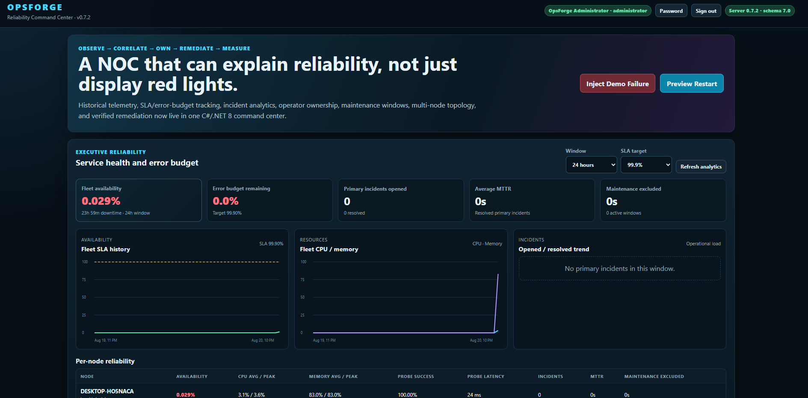
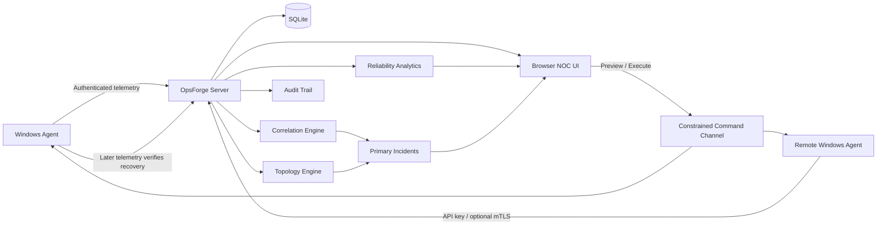

# OpsForge

**A .NET 8 IT operations and incident-response platform for monitoring distributed Windows systems, correlating failures, managing incidents, and measuring service reliability.**

[](https://dotnet.microsoft.com/)
[](https://learn.microsoft.com/dotnet/csharp/)
[](https://www.sqlite.org/)
[](LICENSE.txt)
[](CHANGELOG.md)

**Distributed agents · Incident correlation · RBAC · Audit logging · Reliability analytics · Controlled remediation**

---

## Overview

OpsForge is a self-contained IT operations / NOC lab built with C# and .NET 8.

It combines a central ASP.NET Core server, authenticated Windows agents, persistent telemetry, topology discovery, incident correlation, operator workflows, reliability analytics, and a constrained remediation channel into a single runnable environment.

The project models the operational lifecycle around a failure:

**observe → correlate → acknowledge → assign → investigate → preview remediation → execute → verify recovery → measure reliability**

OpsForge is a portfolio/lab platform with increasingly production-oriented controls. It is not presented as a finished enterprise monitoring or security product.

---

## Screenshot

<p align="center">
  
</p>

<p align="center">
  <em>OpsForge operations dashboard showing monitored systems, incidents, telemetry, reliability, and operator workflows.</em>
</p>

---

## What OpsForge Demonstrates

* Distributed system monitoring
* Authenticated agent/server communication
* Windows process and service telemetry
* HTTP, TCP, and DNS probes
* Incident correlation and probable root cause
* Dependency topology and blast-radius analysis
* Role-based access control
* Operator acknowledgement and incident ownership
* Persistent audit logging
* Maintenance windows
* SLA and error-budget calculations
* MTTR and reliability analytics
* Persistent telemetry history
* Constrained remote remediation
* Remediation verification
* SQLite schema evolution
* Security-conscious agent enrollment and key rotation
* Optional certificate-bound agent identity

---

## First 60 Seconds

### Requirements

* Windows 10/11 or Windows Server for the complete local demo
* .NET 8 SDK available through `dotnet`
* PowerShell 5.1 or newer
* A modern web browser

No Node.js, Python, external database server, or previous OpsForge version is required.

### Start the lab

Clone or download OpsForge, open the repository root, and double-click:

```text
START-HERE.cmd
```

The startup script:

1. Performs a real `dotnet build`
2. Stops if compilation fails
3. Initializes a fresh SQLite database when needed
4. Starts the OpsForge server
5. Starts the deliberately killable demo HTTP service
6. Starts a local Windows monitoring agent
7. Opens the dashboard at:

```text
http://localhost:5080
```

### First Login

On the first run, open:

```text
data/security/admin-bootstrap.txt
```

Sign in as:

```text
admin
```

using the temporary password in that file.

OpsForge requires the bootstrap password to be replaced with a permanent password. The obsolete bootstrap credential file is removed after the password change succeeds.

### Trigger a Complete Incident Workflow

Once signed in:

1. Use **Inject Demo Failure**
2. Watch multiple symptoms become a correlated Primary Incident
3. Acknowledge the incident
4. Take ownership
5. Preview the proposed restart
6. Execute the remediation
7. Wait for later telemetry to verify recovery
8. Open **Executive Reliability** to review availability, SLA/error budget, MTTR, trends, resource history, and per-node reliability

This provides a complete working demonstration without requiring external infrastructure.

---

## Architecture



### Solution Layout

```text
OpsForge/
├── OpsForge.Server/          # ASP.NET Core server, UI, persistence,
│                             # correlation, topology and reliability
├── OpsForge.Agent/           # Windows telemetry, probes and command agent
├── OpsForge.Contracts/       # Shared DTOs / contracts
├── OpsForge.DemoService/     # Deliberately killable demonstration service
├── OpsForge.sln              # Complete .NET solution
├── START-HERE.cmd            # Build + launch complete local lab
├── STOP-OPSFORGE.cmd         # Stop local OpsForge processes
├── Test-OpsForge.ps1         # Full-build compiler/runtime smoke test
├── Publish-Remote-Agent.ps1  # Build a copyable remote-agent package
├── CHANGELOG.md
└── LICENSE.txt
```

---

## Core Capabilities

### Monitoring

Agents can collect or evaluate:

* CPU and memory usage
* Process state
* Windows service state
* HTTP endpoints
* TCP endpoints
* DNS resolution
* Agent heartbeat / availability
* Inventory and status information

Telemetry is persisted so the UI can show both current state and historical reliability.

### Multi-Agent Operations

OpsForge supports multiple enrolled agents rather than assuming a single monitored machine.

The server maintains agent inventory, live status, persistent telemetry, agent-specific credentials, API-key fingerprints, revocation state, historical reliability, and topology relationships.

---

## Incident Correlation

OpsForge does not treat every failed probe as an unrelated alert.

The correlation engine can combine multiple symptoms into a **Primary Incident** using deterministic reasoning based on system relationships and evidence.

Capabilities include:

* Probable root cause
* Confidence information
* Dependency traversal
* Blast-radius analysis
* Derivative-signal suppression
* Incident reassessment as telemetry changes
* Persistent incident history
* Markdown incident reports

The default local demo models:

```text
OpsForge.DemoService process
        ↓
TCP listener :5091
        ↓
HTTP /health
```

Killing the demo process therefore creates multiple symptoms that can be correlated into one operational incident rather than three unrelated alerts.

---

## Incident Workflow

### Acknowledge

Records that someone has seen and accepted responsibility for investigating the incident.

### Take Ownership / Assign

Associates a specific Operator or Administrator with the incident.

### Release Ownership

Returns an incident to the unowned queue.

### Maintenance Suppression

Keeps diagnostic evidence visible while removing planned failures from actionable NOC counts during a valid maintenance window.

### Preview → Execute → Verify

OpsForge intentionally separates command execution from recovery.

```text
Preview remediation
        ↓
Operator approval
        ↓
Execute constrained command
        ↓
Wait for subsequent telemetry
        ↓
Verify recovery
```

A command returning successfully does **not** automatically mark a system healthy. Later monitoring evidence must verify recovery.

---

## Reliability Command Center

The v0.7 line adds persistent reliability analytics.

Available views include:

* 24-hour, 7-day, and 30-day reliability
* Fleet and per-agent availability
* Configurable SLA target
* Remaining error budget
* CPU and memory history
* Probe success rate and average latency
* Incident-open and resolution trends
* Mean time to recovery (MTTR)
* Per-node telemetry history
* Maintenance-excluded monitored time
* Active maintenance counts
* Acknowledged and unowned incident counts

Telemetry samples are retained for 30 days and throttled to keep the local SQLite database compact.

### Availability Model

OpsForge does not silently interpret missing telemetry as healthy.

A heartbeat creates a short healthy interval. Once the offline threshold is exceeded, the remaining gap is counted as unavailable until communication resumes.

Planned maintenance is excluded from the SLA denominator.

Maintenance cannot be backdated by more than five minutes, preventing an operator from rewriting a historical outage as planned maintenance after the fact.

---

## Roles and RBAC

### Viewer

Read-only access to NOC status, reliability, incidents, topology, telemetry history, reports, inventory, and maintenance visibility.

### Operator

Includes Viewer permissions plus incident acknowledgement/ownership, maintenance scheduling/cancellation, failure injection, and remediation.

### Administrator

Includes Operator permissions plus user management, agent enrollment, API-key rotation/revocation, certificate binding, and security audit visibility.

---

## Operator Authentication

Operator credentials use:

* PBKDF2-SHA256 password hashing
* Per-user random salts
* 210,000 PBKDF2 iterations
* Forced replacement of temporary passwords
* Server-side sessions
* 8-hour interactive session lifetime
* HttpOnly session cookies
* SameSite=Strict session behavior
* CSRF protection on browser mutation requests
* Login throttling

Password reset revokes active sessions and forces another password change.

---

## Audit Trail

Security and operational changes are persisted with attribution.

Audit records include information such as actor, role, action, target, outcome, source IP, detail, and UTC timestamp.

Examples include:

* Authentication events
* Incident acknowledgement
* Ownership changes
* Maintenance scheduling/cancellation
* Remediation actions
* Agent enrollment/security operations
* Key rotation and revocation

---

## Agent Enrollment and Authentication

Each non-revoked agent receives its own high-entropy API key.

The server stores the key hash and fingerprint rather than the plaintext credential.

Authenticated operations include heartbeat, telemetry submission, command polling, and command-result submission.

The initial enrollment token is stored locally at:

```text
data/security/enrollment-token.txt
```

A remote agent uses that token only for initial enrollment.

Administrators can rotate an agent API key or revoke an agent. Rotation invalidates the old key immediately.

---

## Optional Agent mTLS

OpsForge supports optional certificate-bound agent identity.

When enabled, remote agent requests can require both the valid API key and the client certificate associated with that agent.

Example:

```powershell
$env:OPSFORGE_AGENT_MTLS = '1'
$env:OPSFORGE_LISTEN_URL = 'https://0.0.0.0:5443'
```

Configure the normal ASP.NET Core/Kestrel server certificate separately.

When mandatory agent mTLS is enabled, remote agent traffic cannot silently downgrade to plain LAN HTTP.

---

## Adding Another Windows Agent

Build a copyable remote-agent package:

```powershell
.\Publish-Remote-Agent.ps1
```

This creates:

```text
dist\OpsForge.Agent
```

Copy that folder to another Windows machine and configure its `agent.json`.

For first enrollment:

```powershell
$env:OPSFORGE_AGENT_ENROLLMENT_TOKEN = '<server enrollment token>'
.\RUN-AGENT.cmd
```

For multi-machine use, deploy the OpsForge server behind HTTPS and appropriate firewall/reverse-proxy controls.

---

## Maintenance Windows

Operators can schedule maintenance for one enrolled agent or the entire fleet.

Maintenance records include the name, reason, start/end times, creator, creation time, cancellation state, and cancellation attribution.

During active maintenance:

* Diagnostic evidence remains available
* Matching incidents can be removed from actionable counts
* Matching time is excluded from reliability/SLA calculations

This preserves operational history without penalizing planned maintenance.

---

## Persistence

OpsForge uses SQLite for local persistence.

Default database:

```text
data/opsforge.db
```

The v0.7 schema persists telemetry samples, maintenance windows, incident workflow, incidents, commands, inventory, agent state, authentication, sessions, and audit events.

Generated databases and credentials are excluded from source control.

The repository's `.gitignore` excludes:

```text
data/*.db
data/*.db-shm
data/*.db-wal
data/security/
data/agents/
*.credentials.json
*.pfx
```

---

## Testing

Run the full-build smoke test:

```powershell
.\Test-OpsForge.ps1
```

It performs a real `dotnet build` and exercises a clean temporary environment, including:

* Compilation
* Database initialization
* Bootstrap login/password replacement
* RBAC denial
* Agent enrollment
* Authenticated telemetry
* Deterministic incident correlation
* Incident acknowledgement/ownership
* Maintenance suppression
* Reliability/history analytics
* Maintenance cancellation
* Inventory
* Audit attribution

The temporary test environment is removed afterward and does not overwrite the normal OpsForge database.

---

## Build Manually

```powershell
dotnet restore
dotnet build OpsForge.sln
```

Then use the included startup scripts for the integrated demonstration environment.

---

## Version History

See the detailed [`CHANGELOG.md`](CHANGELOG.md).

### v0.7.2

Current version.

* Fixed build issues discovered after the v0.7 reliability release
* Preserves the complete v0.7 feature set
* Ships as a standalone/full source build

### v0.7.x

Added reliability history, SLA/error-budget calculations, MTTR analytics, Executive Reliability dashboard, incident acknowledgement and ownership, maintenance windows, maintenance-aware SLA calculations, and expanded audit attribution.

### v0.6.x

Added named operator accounts, Viewer/Operator/Administrator RBAC, password hashing, sessions, CSRF protection, login throttling, persistent audit logging, and optional agent mTLS.

### v0.5.x

Added authenticated enrollment, per-agent API keys, inventory/status persistence, and key rotation/revocation.

### v0.4.x

Added multi-node topology, cross-machine dependencies, blast-radius analysis, and derivative-alert suppression.

### v0.3.x

Added deterministic multi-signal correlation, root-cause reasoning, confidence information, and Primary Incident reporting.

### v0.2.x

Added SQLite persistence, HTTP/TCP/DNS probes, Windows service monitoring, MTTR, timeline history, and Preview → Execute → Verify remediation.

### v0.1.x

Introduced the .NET 8 server, Windows telemetry agent, browser dashboard, constrained command channel, and demo service.

---

## Adding the Screenshot

The README expects:

```text
docs/images/opsforge-dashboard.png
```

### Using GitHub

1. Open the OpsForge repository.
2. Choose **Add file → Create new file**.
3. Enter `docs/images/.gitkeep`.
4. Commit the file.
5. Open `docs/images/`.
6. Choose **Add file → Upload files**.
7. Upload your screenshot as `opsforge-dashboard.png`.
8. Commit the change.

### Using Git Locally

```powershell
New-Item -ItemType Directory -Force docs\images
```

Copy the screenshot to:

```text
docs/images/opsforge-dashboard.png
```

Then:

```bash
git add README.md docs/images/opsforge-dashboard.png
git commit -m "Add professional OpsForge README and dashboard screenshot"
git push
```

Before publishing, make sure the screenshot contains no real API keys, enrollment tokens, passwords, private production hostnames/IPs, or user/customer information.

A clean PNG around **1400–1800 px wide** works well.

---

## Security Scope

OpsForge is a portfolio/lab platform with production-oriented controls.

It does **not** currently claim to provide every control expected from a hardened enterprise monitoring platform.

Not currently included:

* SSO / OIDC / SAML
* MFA
* Centralized secrets-vault integration
* Complete PKI lifecycle management
* CRL / OCSP handling
* Signed automatic updates
* High-availability database/session storage
* Hardened enterprise installer
* Full production deployment automation

For network-accessible deployment, use HTTPS, firewall restrictions, least-privilege service accounts, appropriate reverse-proxy controls, secure certificate management, protected secrets, and appropriate host hardening.

---

## Project Status

OpsForge is actively developed as a portfolio and systems-engineering project.

It demonstrates practical work across C#/.NET 8, ASP.NET Core, distributed-agent architecture, Windows monitoring, incident-response workflows, observability/reliability concepts, SQLite, authentication/RBAC, API-key lifecycle management, security auditing, network probes, topology modeling, automated smoke testing, and release management.

---

## License

OpsForge is released under the [MIT License](LICENSE.txt).

---

## Author

**Daniel Fuhr**

* GitHub: [github.com/fuhrdan](https://github.com/fuhrdan)
* LinkedIn: [linkedin.com/in/danielfuhr](https://www.linkedin.com/in/danielfuhr/)
* Portfolio: [lakehousesoftware.com](https://lakehousesoftware.com/)

---

## Why This Project Matters

OpsForge demonstrates the kind of systems work that sits between software development and IT operations.

Rather than building only a dashboard or only a monitoring agent, the project carries an operational event through **telemetry, authentication, dependency modeling, correlation, human ownership, remediation, verification, historical persistence, auditability, and reliability measurement**.

That end-to-end operational lifecycle is the core of the project.
